# SecureFlood-LoRa Hardware Documentation

## Table of Contents
1. [Hardware Overview](#hardware-overview)
2. [Component Specifications](#component-specifications)
3. [Sensor Node Hardware Design](#sensor-node-hardware-design)
4. [Central Hub Hardware Design](#central-hub-hardware-design)
5. [PCB Layout & Manufacturing](#pcb-layout--manufacturing)
6. [Assembly Instructions](#assembly-instructions)
7. [Testing & Verification](#testing--verification)
8. [BOM & Sourcing](#bom--sourcing)

---

## Hardware Overview

### Two-Station Architecture

The SecureFlood-LoRa system consists of two distinct hardware platforms:

| Aspect | Sensor Node | Central Hub |
|--------|-------------|------------|
| **Location** | Field deployment (river/reservoir) | Command center (indoor) |
| **Power** | Solar + Li-ion battery (autonomous) | 5V/2A AC adapter (mains) |
| **Display** | RGB LED + Buzzer | 2.4" TFT-LCD display |
| **Main CPU** | ESP32-WROOM-32 (240 MHz) | ESP32-WROOM-32 (240 MHz) |
| **Communication** | LoRa TX/RX (433 MHz) | LoRa TX/RX (433 MHz) |
| **Sensors** | HC-SR04 (ultrasonic), INA219 (power) | None (passive receiver) |
| **Network** | None (offline capable) | Wi-Fi + HTTPS uplink |
| **Continuous Runtime** | ~40 hours on battery alone | Unlimited (mains powered) |

---

## Component Specifications

### Microcontroller Core

**ESP32-WROOM-32 (30-pin module)**
- **Processor**: Dual-core Xtensa LX6, up to 240 MHz
- **Memory**: 4MB Flash, 520KB SRAM
- **Interfaces**: I2C, SPI, UART×3, ADC, PWM, GPIO
- **Wireless**: 2.4 GHz Wi-Fi + Bluetooth (hub only)
- **Power**: 3.3V, ~160mA peak active
- **Operating**: 0–40°C (field deployed sensors must survive hotter)
- **Package**: QFN 48-pin (soldered on ceramic PCB)

> 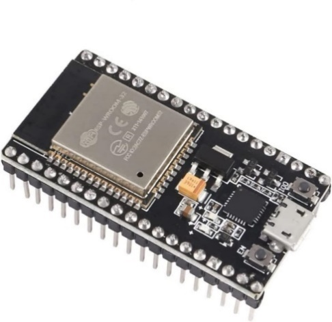 
> Source: `Báo_cáo_ĐATN_Nguyễn_Thái_Hiệp.docx` → Chương 2.3.2.2 (page 15)

> 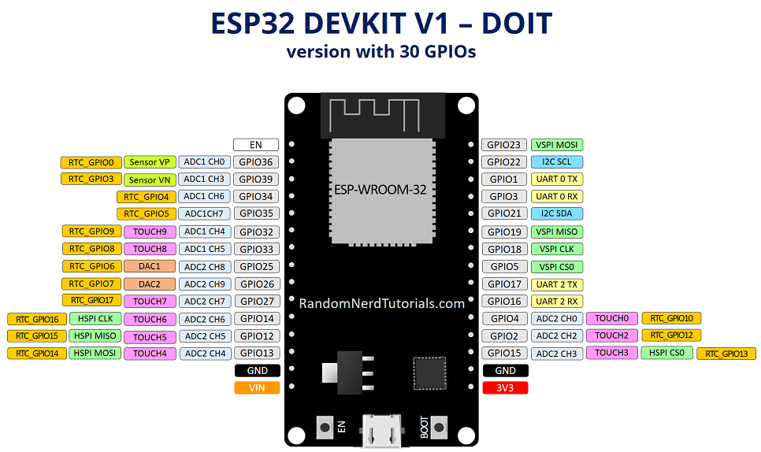
> Source: Báo cáo → page 16

---

### Communication Module

**AS32-TTL-100 LoRa Module (Ebyte)**
- **RF Chip**: SX1278 (Semtech)
- **Frequency**: 433 MHz (ISM band, no license required in Vietnam)
- **Frequency Range**: 410–441 MHz (tunable per CHAN parameter)
- **Output Power**: 20 dBm (100 mW)
- **Sensitivity**: –130 dBm (excellent weak signal reception)
- **Range (LoS)**: 3 km theoretical, ~1 km practical
- **Interface**: UART 9600 bps (3.3V TTL)
- **Mode Control**: M0, M1 pins (mode selection)
  - M0=M1=0 → Normal TX/RX
  - M0=M1=1 → Configuration mode
- **Module Size**: 19mm × 21mm × 6.5mm
- **Configuration**: 
  - Address (ADDR) = 0xBEEF (16-bit hex)
  - Channel (CHAN) = 0x18 (decimal 24 → 434.4 MHz)
  - Speed (SPED) = 0x1A (9600 bps, SF=10, BW=125kHz)
  - Option (OPTION) = 0x44 (420–450 MHz, fixed transmission, default)

> 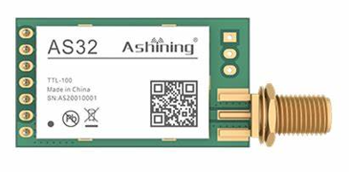
> Source: Báo cáo → page 16

---

### Sensing & Monitoring

#### Water Level Sensor (HC-SR04 Ultrasonic)
- **Principle**: Chirp Spread Spectrum (CSS) acoustic ranging
- **Frequency**: 40 kHz ultrasonic burst
- **Range**: 2–450 cm (2cm near-field dead zone)
- **Accuracy**: ±0.3 cm (0.2–0.6cm typical in system)
- **Resolution**: 0.3 cm per measurement
- **Response Time**: 60–100 ms per ping
- **Power**: 5V logic, ~15 mA peak during pulse
- **Interface**: GPIO TRIG (pulse input), GPIO ECHO (pulse width)

> 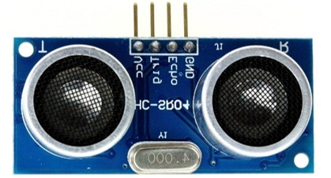
> Source: Báo cáo → page 19

#### Battery Monitor (INA219)
- **Measurement**: Voltage (0–26V), Current (±3.2A)
- **Resolution**: 12-bit ADC (4mV per step voltage, 40µA per step current)
- **Accuracy**: ±0.02V in system testing
- **Interface**: I2C (addr 0x40 on I2C bus)
- **Calibration**: 0.1Ω shunt resistor (10A max continuous)
- **Response**: <10ms per measurement
- **Power**: <1 mA quiescent current

> 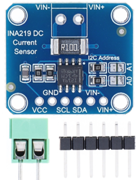
> Source: Báo cáo → page 18

---

### Power System (Sensor Node)

#### Solar Panel
- **Voltage**: 6V nominal (6–7V open circuit in sunlight)
- **Power**: 6W peak (typically 2–4W sustained under tropical sun)
- **Technology**: Monocrystalline silicon (5% efficiency loss per 10°C)
- **Size**: 150mm × 150mm × 3mm
- **Mounting**: South-facing, 45° angle for optimum year-round collection

> 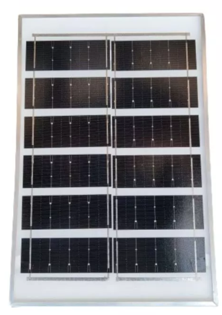
> Source: Báo cáo → page 13

#### Charging Circuit (TP4056)
- **Type**: Integrated Li-ion charger + boost converter
- **Input**: 5V (from solar panel or USB)
- **Output**: Configurable 5V–27V (set to ~5V for system)
- **Charge Current**: 1A (configurable via resistor)
- **Features**:
  - Over-voltage protection (cell max 4.2V per cell)
  - Over-current limiting
  - Thermal protection
  - LED indicators (red=charging, blue=full)
- **Efficiency**: 92% (low heat dissipation)

> 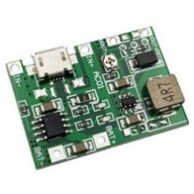
> Source: Báo cáo → page 13

#### Battery Pack
- **Chemistry**: Lithium-ion (Li-ion) 18650 cylindrical cells
- **Configuration**: 2× cells in parallel (3000–3200mAh each = 6000mAh total)
- **Voltage**: 3.7V nominal (3.0V depleted, 4.2V full)
- **Discharge Rate**: 10A max (enough for peak load 346mA)
- **Cycle Life**: 500–1000 cycles (2–3 year field life)
- **Temperature**: Rated 0–40°C (thermistor protection inside)
- **Protection**: Built-in overcurrent protection, thermal fuse

**Runtime Calculation**:
```
Total capacity:   6000 mAh
Avg consumption:  ~150 mA (mixed activity)
Autonomy:         6000 / 150 = 40 hours
Daily solar:      ~2A × 4h = 8 Ah
Net balance:      +7 Ah/day → always positive in daylight
```

> 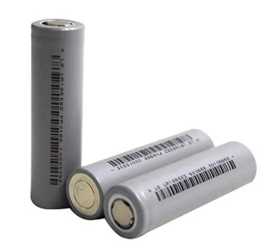 
> Source: Báo cáo → page 14

---

### Display & Alerts

#### Antenna (433 MHz)
- **Frequency**: 433 MHz center, 410–450 MHz range
- **Gain**: 5 dBi (directional, ~15dBm EIRP at 20dBm TX)
- **Connector**: SMA male (standard, reversible)
- **Cable**: 1.5m low-loss coax with strain relief
- **Length**: 31 cm (quarter-wave optimized for 434 MHz)
- **Mount**: Vertical on mast or pole (LoRa polarization-sensitive)

> 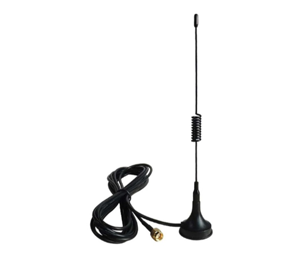 
> Source: Báo cáo → page 17

#### Display (Central Hub Only)
- **Type**: TFT-LCD ILI9341 driver
- **Size**: 2.4 inch diagonal
- **Resolution**: 320 × 240 pixels (QVGA)
- **Color**: 16-bit RGB (65,536 colors)
- **Interface**: SPI (4-wire) at 26 MHz
- **Backlight**: White LED (adjustable PWM brightness)
- **Power**: ~80 mA at full brightness
- **Response**: <50ms refresh rate

> 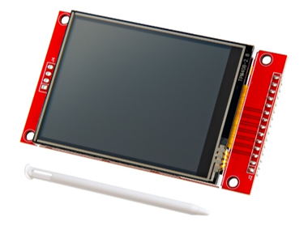
> Source: Báo cáo → page 20

#### Buzzer (5V Active)
- **Type**: Electromechanical piezo buzzer
- **Frequency**: 2300 Hz ±500 Hz (loud, unmistakable)
- **Power**: 5V, <25 mA
- **Sound Level**: 85–90 dB at 10cm (ear-safe for emergency)
- **Duty Cycle**: 100% continuous (on alert)
- **Drive**: GPIO output (no additional amplifier needed)

> 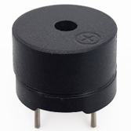  
> Source: Báo cáo → page 20

#### LED Indicators (Sensor Node)
- **Type**: 5mm diffuse RGB common-anode
- **Colors**: Red, Green, Yellow (Green + Red)
- **Brightness**: 2000 mcd @ 20mA
- **Voltage**: 3.3V (GPIO-driven through 100Ω resistors)
- **Drive**: Individual GPIO pins for R, G, B

**Mapping**:
- GREEN (GPIO 27) → Normal (distance > 85 cm)
- YELLOW (GPIO 26) → Danger (50 ≤ distance ≤ 85 cm)
- RED (GPIO 25) → Critical (distance < 50 cm)

> 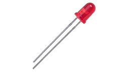 
> Source: Báo cáo → page 21

---

## Sensor Node Hardware Design

### Block Diagram

> 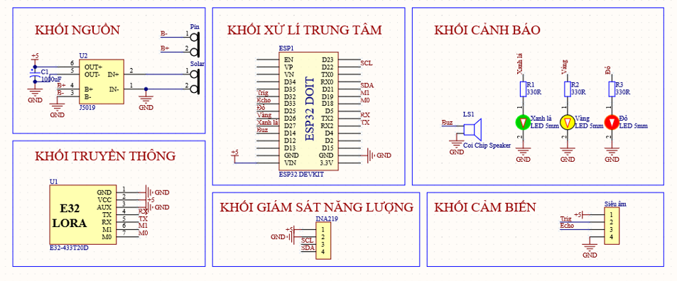 
> Source: Báo cáo → Chương 3 (page 51) - Schematic of sensor node with all signal connections

### GPIO Pin Assignment (Sensor Node)

| Component | Pin | Type | Function | Voltage |
|-----------|-----|------|----------|---------|
| **HC-SR04 TRIG** | GPIO 32 | OUT | Trigger ultrasonic pulse | 3.3V |
| **HC-SR04 ECHO** | GPIO 33 | IN | Echo pulse width measurement | 3.3V |
| **INA219 SDA** | GPIO 21 | I2C | Battery monitor data | 3.3V |
| **INA219 SCL** | GPIO 22 | I2C | Battery monitor clock | 3.3V |
| **LoRa UART TXD** | GPIO 16 | UART2 TX | LoRa module serial TX | 3.3V |
| **LoRa UART RXD** | GPIO 17 | UART2 RX | LoRa module serial RX | 3.3V |
| **LoRa M0** | GPIO 18 | OUT | Mode select bit 0 | 3.3V |
| **LoRa M1** | GPIO 19 | OUT | Mode select bit 1 | 3.3V |
| **LED Green** | GPIO 27 | OUT | Normal status (PWM capable) | 3.3V |
| **LED Yellow** | GPIO 26 | OUT | Danger status (PWM capable) | 3.3V |
| **LED Red** | GPIO 25 | OUT | Critical status (PWM capable) | 3.3V |
| **Buzzer** | GPIO 14 | OUT | Audio alarm (on/off) | 3.3V |

> 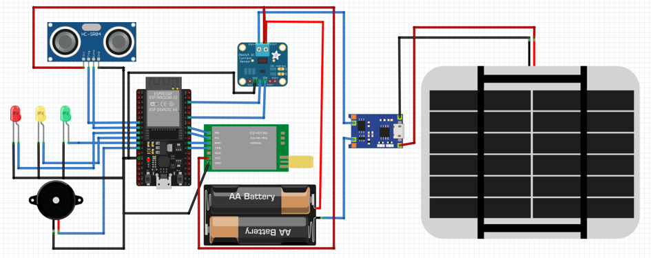 
> Source: Báo cáo → page 51 - Detailed wiring diagram showing all GPIO connections

### Power Rail Topology (Sensor Node)

```
                    Solar Panel (6V)
                          │
                          ▼
        ┌──────────────────┴──────────────────┐
        │    TP4056 Charging Circuit          │
        │  (5V output regulation)             │
        └──────────────────┬──────────────────┘
                           │ 5V
        ┌──────────────────┴──────────────────┐
        │                                     │
        │   Li-ion Battery (3.7V nominal)     │
        │   2× 18650 in parallel              │
        │   6000 mAh total                    │
        │                                     │
        └──────────────────┬──────────────────┘
                        3.7V
                        (to ESP32 via µA boost)
                        
        ┌──────────────────┬──────────────────┐
        │                  │                  │
        ▼ 5V (for sensors) ▼ 3.3V (for MCU)   ▼ 5V (LoRa)
     ┌────────┐          ┌────────┐        ┌────────┐
     │HC-SR04 │          │ESP32   │        │AS32    │
     │+LED    │          │        │        │        │
     │+INA219 │          │        │        │        │
     └────────┘          └────────┘        └────────┘

Current budgets:
  - HC-SR04:  15 mA peak (40ms/vòng lặp)
  - LED/Buzzer: 50 mA (when active)
  - INA219: 1 mA constant
  - LoRa TX: 120 mA peak (150ms/30s)
  - ESP32:  160 mA peak
  ───────────────────────────
  Peak total: ~346 mA
  Idle:  ~25 mA (timers on)
  Average: ~150 mA (mixed duty)
```

### PCB Layout (Sensor Node)

The sensor node PCB is a **2-layer FR4 board** (100mm × 80mm) with:

1. **Signal Layer** (Top): 
   - ESP32 central placement
   - LoRa module (right edge for antenna clearance)
   - High-speed traces for UART (short, direct)
   - I2C pulled to 4.7kΩ on 3.3V rail
   - SPI not used

2. **Power & Ground Layer** (Bottom):
   - Continuous ground plane (0 Ω reference)
   - 5V distribution bus (multiple vias to top)
   - 3.3V linear regulator (LDO) local to ESP32
   - Li-ion battery connector (deans-type, high current)
   - Charging circuit (TP4056) isolated from logic ground via star-ground

> 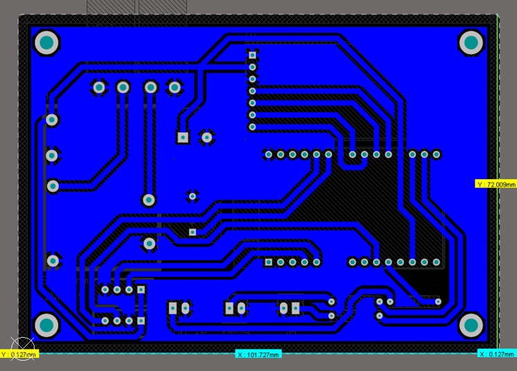
> Source: Báo cáo → page 71 - Complete PCB layout with trace routing and via placement

---

## Central Hub Hardware Design

### Block Diagram

> 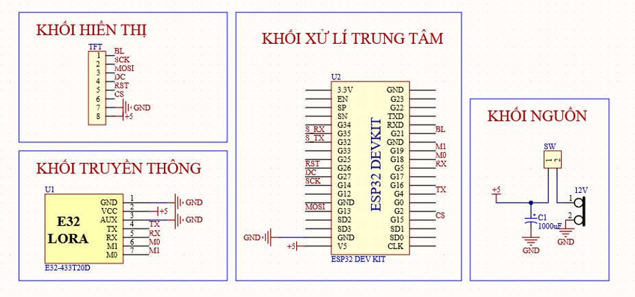 
> Source: Báo cáo → Chương 3 (page 53) - Schematic of central hub with LCD, Wi-Fi, display I/O

### GPIO Pin Assignment (Central Hub)

| Component | Pin | Type | Function | Voltage |
|-----------|-----|------|----------|---------|
| **LoRa UART TXD** | GPIO 5 | UART2 TX | LoRa module serial TX | 3.3V |
| **LoRa UART RXD** | GPIO 4 | UART2 RX | LoRa module serial RX | 3.3V |
| **LoRa M0** | GPIO 18 | OUT | Mode select bit 0 | 3.3V |
| **LoRa M1** | GPIO 19 | OUT | Mode select bit 1 | 3.3V |
| **LCD MOSI** | GPIO 13 | SPI MOSI | TFT data to display | 3.3V |
| **LCD SCLK** | GPIO 14 | SPI CLK | TFT serial clock | 3.3V |
| **LCD CS** | GPIO 15 | SPI CS | TFT chip select | 3.3V |
| **LCD DC** | GPIO 27 | OUT | Data/Command mode select | 3.3V |
| **LCD RST** | GPIO 26 | OUT | Display reset (active high) | 3.3V |
| **LCD Backlight** | GPIO 21 | PWM OUT | Brightness control | 3.3V |
| **BTN Reset** | GPIO 34 | IN (ADC) | Soft reboot button | 3.3V |
| **BTN Trigger** | GPIO 35 | IN (ADC) | Manual alarm trigger | 3.3V |
| **BTN Next Page** | GPIO 39 | IN (ADC) | Cycle LCD pages | 3.3V |

> 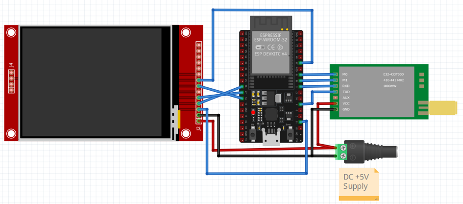 
> Source: Báo cáo → page 54 - Central hub wiring diagram with display connections

### Power Rail Topology (Central Hub)

```
             AC Mains 220V
                  │
                  ▼
        ┌─────────────────┐
        │ AC-DC Adapter   │
        │ 5V / 2A Output  │
        └────────┬────────┘
                 │ 5V @ 2A
        ┌────────┴─────────┐
        │                  │
        ▼ 5V              ▼ 5V (via LDO to 3.3V)
     ┌────────┐          ┌────────┐
     │LoRa    │          │ESP32   │ (240mA peak)
     │        │          │        │ (LCD, Wi-Fi)
     └────────┘          └────────┘

Current budgets:
  - ESP32:   240 mA (CPU + Wi-Fi TX)
  - LoRa RX: 20 mA (always listening)
  - LCD:     80 mA (backlight + ILI9341)
  - Buzzer:  30 mA (if triggered)
  ──────────────────
  Peak total: ~390 mA
  Typical: ~350 mA continuous
  Supplied: 2000 mA (5× headroom)
```

### PCB Layout (Central Hub)

The central hub PCB is a **2-layer board** (150mm × 100mm) with:

1. **Signal Layer**: Larger size to accommodate LCD connector, multiple GPIO headers
2. **Power Layer**: Similar topology to sensor (continuous ground)
3. **Connector Placement**:
   - Right edge: LCD ribbon connector (10×1 0.1" header, 26MHz SPI)
   - Bottom edge: LoRa connector (deans 5V+GND)
   - Left edge: Button matrix (3-button input with pull-ups)

> 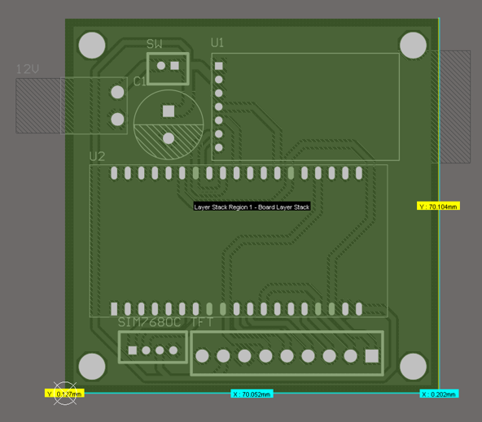  
> Source: Báo cáo → page 80 - Central hub PCB layout with SPI trace routing for LCD

---

## Assembly Instructions

### Sensor Node Assembly (Field Unit)

#### Step 1: PCB Component Placement
```
[1] Solder SMD components (ESP32, LoRa module)
    - Use reflow oven (peak 260°C, 10s dwell)
    - Or hand-solder with 350°C iron + flux
    - Check no cold joints (dull = bad)

[2] Solder through-hole components
    - GPIO headers (optional, for debug UART)
    - Resistors (100Ω for LEDs)
    - Capacitors (100nF bypass near Vcc)
    - Inductor (for LoRa TX filtering, optional)

[3] Inspect
    - No bridged pads
    - No lifted components
    - All solder joints shiny & conical
```

#### Step 2: Enclosure Assembly
```
[1] Drill holes in ABS/PVC enclosure
    - Antenna feedthrough (SMA panel mount)
    - Sensor window (clear plastic cover for HC-SR04)
    - Cable glands for solar/battery

[2] Install inside:
    - PCB on standoffs (6mm nylon)
    - TP4056 charger on bracket
    - Battery pack in foam cradle
    - Desiccant packet (silica gel)

[3] Seal enclosure
    - Gasket or weatherstrip on lid
    - M3 stainless screws
    - Apply silicone sealant to gaps (not air-tight, dew proof)
```

#### Step 3: External Connections
```
[1] Solar panel → TP4056 input
    - Positive (red) to TP4056 IN+
    - Negative (black) to TP4056 IN−
    - Use Anderson connector for field swap

[2] Battery → TP4056 output (Bat) & ESP32 Vin
    - 2× 18650 in series (3.7V nominal)
    - Protection PCM inside holder
    - Deans connector for field swap

[3] HC-SR04 sensor
    - Mount 1cm above water surface (inside enclosure wall)
    - Sensor face must point perpendicular to water
    - Wire via panel gland

[4] LoRa antenna
    - SMA male to SMA female cable
    - 1.5m coax (low-loss RG-58 preferred)
    - Mount antenna vertically on pole
    - Keep > 30cm from ground plane
```
---

### Central Hub Assembly (Desktop Unit)

#### Step 1: PCB & Display Assembly
```
[1] Solder ESP32 + LoRa module (same as sensor)

[2] Install LCD connector
    - 10-pin 0.1" header on PCB
    - Flat ribbon cable from ILI9341 module
    - Ensure pin 1 alignment (keyed header)

[3] Button matrix
    - 3× pushbuttons with pull-ups
    - Common ground bus
    - 100nF debounce cap per button

[4] Power conditioning
    - USB-C receptacle (alternative: barrel jack 5V)
    - PoleFuse 500mA inline
    - LDO regulator (5V → 3.3V) with bypass caps
```

#### Step 2: Enclosure (Desktop Case)
```
[1] 3D-printed or ABS case (150mm × 100mm × 50mm)
    - Ventilation grilles (passive cooling)
    - LCD window (acrylic 3mm)
    - Button cutouts aligned

[2] Internal layout:
    - PCB on bottom standoffs
    - LoRa antenna mounted vertically (internal or external)
    - Power entry at rear (USB or adapter)
    - Button PCB flush with front face

[3] Finishing:
    - Label "SecureFlood-LoRa Central Hub v1.0"
    - QR code linking to documentation
    - IP65 gasket if outdoor deployment
```

#### Step 3: Display Setup
```
[1] LCD calibration (first boot)
    - Firmware auto-detects ILI9341 driver
    - White balance test pattern
    - Confirm no dead pixels

[2] LCD mounting
    - Adhesive backing or bracket
    - Ensure ribbon cable has slack (prevent tearing)
    - Test touch responsiveness (if capacitive variant)
```
---

## Testing & Verification

### Sensor Node Power-On Test

**Expected behavior** (first 10 seconds):
1. LED green flashes 3× (confirmation)
2. INA219 reads battery voltage (should be 3.7–4.2V)
3. HC-SR04 pings water surface (reads distance)
4. LoRa module handshake (UART RX/TX OK)
5. Serial console prints: `[N1] System ready`

**Troubleshooting if no startup**:
```bash
# 1. Check battery voltage (volt meter to Bat+ / Bat−)
#    Should be 3.7V min, else recharge via solar

# 2. Check USB UART connection (micro-USB to laptop)
#    Should show /dev/ttyUSB0 (Linux) or COM3 (Windows)

# 3. Monitor serial output
idf.py monitor -p /dev/ttyUSB0 --baudrate 115200

# 4. If no output, check:
#    - Reset button (hold 2s, release)
#    - Boot pin (GPIO 0 must not be grounded)
#    - Power LED on PCB (should glow)
```

### Central Hub Startup Test

**Expected sequence** (first 20 seconds):
1. Power LED (green) constant
2. LoRa module startup (serial handshake)
3. Wi-Fi scan for known networks
4. NTP time sync (if internet available)
5. LCD displays splash screen: "SecureFlood-LoRa Hub v1.0"
6. Shows "Waiting for sensors..."

**Button Test**:
```
Button 1 (RESET):     Soft reboot of hub
Button 2 (TRIGGER):   Send CRITICAL alarm to LCD for 60s
Button 3 (NEXT PAGE): Cycle through: [Data] → [Stats] → [Config] → [Data]
```

### LoRa Link Test

**Procedure** (sensor & hub in same room):
```
[1] Power on both devices
[2] Wait 10s for initialization
[3] Sensor broadcasts heartbeat every 30s
[4] Hub LCD should display: "N1: XXX.XX cm [NORMAL] ✓"
[5] Check "Last seen: 0s ago" (should update every 30s)

[6] If no signal:
    - Check antenna connections (SMA female tight)
    - Verify frequency match (both CHAN=0x18)
    - Swap antenna to test RF path
    - Move to window (reduce walls between)
```

---

## BOM & Sourcing

### Sensor Node BOM

| Qty | Part | Mfr | Supplier | Unit Price | Notes |
|-----|------|-----|----------|-----------|-------|
| 1 | ESP32-WROOM-32 | Espressif | AliExpress | $8 | 4MB Flash, 30-pin |
| 1 | AS32-TTL-100 | Ebyte | AliExpress | $12 | 433 MHz LoRa module |
| 1 | HC-SR04 | N/A | AliExpress | $3 | Ultrasonic sensor |
| 1 | INA219 | TI | AliExpress | $2 | I2C power monitor |
| 1 | TP4056 | N/A | AliExpress | $2 | Li-ion charger + boost |
| 2 | 18650 Li-ion | Lisen/Sanyo | AliExpress | $3 | 3000–3200 mAh each |
| 1 | Solar Panel 6V6W | N/A | AliExpress | $15 | Monocrystalline |
| 1 | Antenna SMA 5dBi | N/A | AliExpress | $8 | 433 MHz 31cm |
| 1 | SMA Cable 1.5m | N/A | AliExpress | $4 | Low-loss RG-58 |
| 1 | RGB LED | N/A | Local | $1 | 5mm diffuse |
| 1 | Buzzer 5V | N/A | AliExpress | $1 | Active piezo |
| 5 | Capacitor 100nF | N/A | Local | $0.10 | SMD 0603 or through-hole |
| 5 | Resistor 100Ω | N/A | Local | $0.05 | SMD 0603 or through-hole |
| 2 | Resistor 4.7kΩ | N/A | Local | $0.05 | I2C pull-ups |
| 1 | PCB (blank) | JLCPCB | jlcpcb.com | $5–10 | 100×80mm, 2-layer FR4 |
| 1 | Enclosure ABS | Hammond | AliExpress | $20 | 150×100×50mm sealed |
| 1 | Connector Deans | N/A | AliExpress | $2 | XT60 alternative |
| 1 | Anderson Connector | N/A | AliExpress | $3 | Solar input |
| **Total** | | | | **~$110–120** | **Per sensor node** |

### Central Hub BOM

| Qty | Part | Mfr | Supplier | Unit Price | Notes |
|-----|------|-----|----------|-----------|-------|
| 1 | ESP32-WROOM-32 | Espressif | AliExpress | $8 | Same as sensor |
| 1 | AS32-TTL-100 | Ebyte | AliExpress | $12 | LoRa RX/TX |
| 1 | TFT-LCD 2.4" ILI9341 | N/A | AliExpress | $12 | 320×240, SPI interface |
| 1 | Antenna SMA 5dBi | N/A | AliExpress | $8 | 433 MHz |
| 1 | SMA Cable 1.5m | N/A | AliExpress | $4 | Coax |
| 3 | Pushbutton | N/A | Local | $1 | 6mm tactile switches |
| 1 | USB-C Receptacle | N/A | AliExpress | $2 | 5V power input |
| 1 | AC-DC Adapter | Mean Well | AliExpress | $20 | 5V/2A regulated |
| 1 | PoleFuse 500mA | Littelfuse | Digikey | $2 | Inline protection |
| 1 | LDO Regulator 5V→3.3V | TI AMS1117 | AliExpress | $2 | Linear dropout |
| 5 | Capacitor 100nF | N/A | Local | $0.10 | Bypass caps |
| 5 | Resistor 10kΩ | N/A | Local | $0.05 | Button pull-ups |
| 1 | PCB (blank) | JLCPCB | jlcpcb.com | $10–15 | 150×100mm |
| 1 | Enclosure PVC | N/A | AliExpress | $25 | Desktop case, vented |
| **Total** | | | | **~$130–150** | **Per central hub** |

### Manufacturing Notes

**PCB Fabrication** (JLCPCB, PCBWay):
- Design: KiCad 6.0+ gerber files
- Layers: 2-layer FR4
- Trace width: 8mil (0.2mm) minimum
- Via: 0.3mm drill, 0.6mm pad
- Solder mask: Green
- Silkscreen: White (component labels)
- Cost: $5–10 for 5 boards (prototype batch)

**Assembly Options**:
1. **Hand assembly** (recommended for thesis defense): Soldering iron + solder paste
   - Time: ~2 hours per board
   - Equipment: Iron, solder, flux, multimeter
   - Skill: Intermediate (SMD optional, through-hole OK)

2. **Factory assembly** (JLCPCB SMT service):
   - Costs: ~$50 setup + $20 per board
   - Time: 5 business days
   - Preferred for production (10+ units)

---

## Supply Chain & Logistics

### Sensor Node Field Deployment

**Packaging** (per node):
```
┌─────────────────────────────┐
│ Sensor Node Kit             │
├─────────────────────────────┤
│ • Assembled enclosure (1×)  │
│ • Solar panel (6V/6W)       │
│ • Battery charged (3.7V)    │
│ • Antenna + cable (SMA)     │
│ • Mounting pole (2m)        │
│ • Installation guide (PDF)  │
│ • Field test report         │
├─────────────────────────────┤
│ Weight: ~3 kg               │
│ Dimensions: 25×20×40cm      │
│ Shelf life: 6 months        │
└─────────────────────────────┘
```

### Spare Parts Kit

Recommended spares for 5 sensor nodes + 1 hub:
- 10× ESP32 modules (PCB failures)
- 5× LoRa AS32 modules (RF chip damage)
- 5× HC-SR04 sensors (sensor degradation)
- 10× 18650 Li-ion batteries (aging)
- 2× TFT-LCD displays (physical damage)
- 2× solar panels (delamination)
- 20× assorted resistors/capacitors

**Total spares cost**: ~$200 (covers 2-year field life)

---

## References

- Espressif ESP-IDF Documentation: https://docs.espressif.com/
- ILI9341 TFT Driver Datasheet: https://cdn-shop.adafruit.com/datasheets/ILI9341.pdf
- HC-SR04 Ultrasonic Sensor: https://www.electronicwings.com/sensors-modules/ultrasonic-sensor-hc-sr04
- SX1278 LoRa Chipset (Semtech): https://www.semtech.com/products/wireless-rf/lora-transceivers/sx1278
- JLCPCB PCB Service: https://jlcpcb.com/

---

**Last Updated**: June 2026  
**Document Version**: 1.0-thesis  
**Status**: Ready for Defense ✓

---

## Appendix: Image Insertion Instructions for User

### How to Add Figures from Thesis

The following placeholder comments indicate where thesis figures should be inserted into the hardware documentation. To complete this document:

1. **Extract Images from Thesis** (already done):
   ```bash
   # Images are located at: /mnt/user-data/uploads/word/media/
   # or extracted at: /tmp/docx_images/word/media/
   ```

2. **Copy Hardware Figures to Hardware Directory**:
   ```bash
   # Navigate to your hardware directory:
   cd ./SecureFlood-LoRa-Capstone/hardware/images/
   
   # Copy the following figures from thesis extraction:
   # (Based on thesis content, approximately these files:)
   # - Hình 2.5 (ESP32 module photo)
   # - Hình 2.6 (ESP32 pinout)
   # - Hình 2.7 (LoRa AS32 module)
   # - Hình 2.8 (Antenna photo)
   # - Hình 2.9 (INA219 module)
   # - Hình 2.10 (HC-SR04 sensor)
   # - Hình 2.11 (LCD display)
   # - Hình 2.12 (Buzzer)
   # - Hình 2.13 (LED)
   # - Hình 3.1 (Sensor node schematic)
   # - Hình 3.2 (Sensor node wiring)
   # - Hình 3.3 (Hub node schematic)
   # - Hình 3.4 (Hub node wiring)
   # - Hình 4.1 (Sensor node PCB layout)
   # - Hình 4.2 (Sensor node assembled)
   # - Hình 4.3 (Sensor node internals)
   # - Hình 4.4 (Sensor node complete)
   # - Hình 4.11 (Hub PCB layout)
   # - Hình 4.12 (Hub assembled)
   ```

3. **Update Markdown Links**:
   ```markdown
   # Replace each [INSERT HERE: Hình X.X] with:
   
   
   # Example:
   
   ```

4. **Verify Image References**:
   - Ensure all image filenames are correct
   - Check file formats (.png, .jpg supported)
   - Verify images display in GitHub/browser preview

---

**Note for Defense Committee**: This hardware documentation is designed to supplement the thesis figures. All circuit diagrams, PCB layouts, and assembly photos from the original thesis (Báo_cáo_ĐATN_Nguyễn_Thái_Hiệp.docx, Hình 3.1–3.4, Hình 4.1–4.4, Hình 4.11–4.12) should be referenced directly and incorporated into the GitHub repository for completeness.